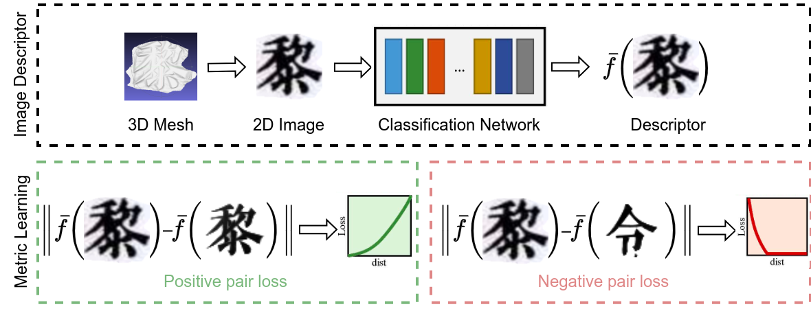

# Sino-nom Character Retrieval
INT3404E 20 - Image Processing: Image Retrieval
## Introduction
This repo contains the code for an image retrieval pipeline designed to retrieve Sino-nom characters. The dataset includes 3D items in the database folder and 2D items in the query folder. The task is to retrieve the 5 most similar 3D items for each query image.

## Table of Contents
- [Repo Tree](#repo-tree)
- [Approach](#approach)
- [Result](#result)
- [Contributors](#contributors)
## Repo Tree
```
├── classification            # Code for classification pipeline
│   ├── dataset.py            # PyTorch dataset
│   ├── transform.py          # Augmentation code
│   ├── ml_decoder            # SOTA ML Decoder classification head
├── retrieval                 # Code for retrieval pipeline
│   ├── oml 
│   │   ├── timm_extractor.py # Custom OML extractor with timm body
│   │   ├── dataset.py        # PyTorch dataset
│   │   ├── loss.py           # Triplet loss with online hard triplet mining (later replaced with OML's losses)
│   │   ├── transform.py      # Augmentation code
├── train_classification_timm.ipynb  # Train an image classifier to extract features
├── train_oml.ipynb                  # Train a deep metric learner with open-metric-learning library
├── generate_more_data.py            # Generate more data with different Nom fonts
├── 3Dto2D.ipynb                     # Experiments with depth buffer capturing
├── final_evaluation.ipynb
├── final_evaluation.py
└── requirements.txt
```
## Approach
Although many local feature matching algorithms like SIFT, SURF, or ORB exist, these are designed to achieve speed and efficiency in the retrieval process. We decided to tackle this problem with a deep learning approach, which is expected to outperform traditional methods.

The initial straightforward approach is to train a classifier to extract a feature vector from an input image, then use some distance function to calculate similarity of 2 images. Here's our benchmark results of different distance metrics:

|       | Euclidean | Cosine Similarity | KL Divergence | Cross Entropy |
|-------|-----------|-------------------|---------------|---------------|
| MRR@5 | 0.92      | 0.80              | 0.82          | 0.88          |

Euclidean Distance, though simple, proved to be the most effective. This result can be explained by the fact that cosine similarity is more suited for text, and probabilistic metrics significantly reduce the feature vector dimension, potentially failing to capture complex image features effectively.
### Metric Learning


We improved our results by leveraging metric learning, which trains embedding vectors to be more representative. Similar positive samples have embedding vectors pulled closer together, while negative samples are pushed farther away.

We trained our model on triplet loss, which relies on three terms: an anchor, a positive sample, and a negative sample. The idea is to have the distance from the anchor to the positive sample be smaller than the distance to the negative sample. We found that online triplet mining significantly speeds up training by mining the hardest triplets available in one batch. This approach yielded a final MRR@5 score of 0.957.

## Result
Our final approach using deep metric learning and online hard triplet mining resulted in an impressive MRR@5 score of 0.957, significantly outperforming initial methods and achieving high retrieval accuracy for Sino-nom characters.

## Contributors
- Lê Minh Đức - 22028267
- Nguyễn Hoàng Quân - 22028130
